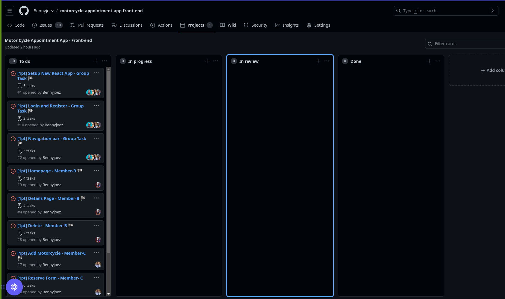
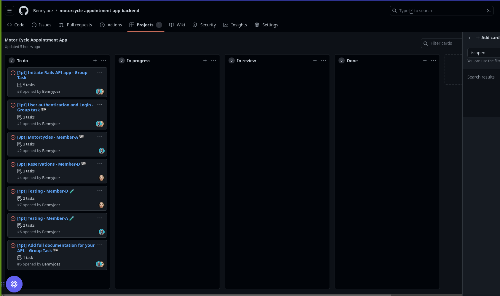
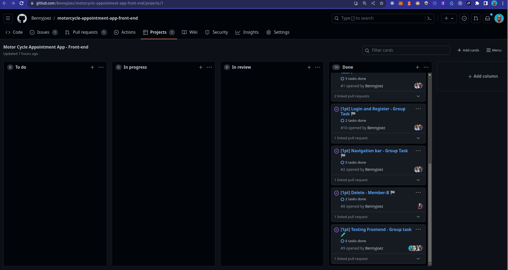
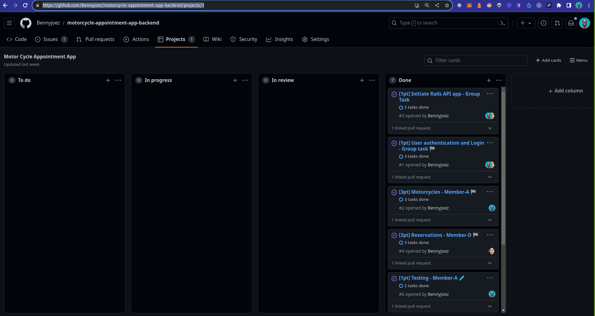

<a name="readme-top"></a>

# 📗 Table of Contents

- [📗 Table of Contents](#-table-of-contents)
- [🛵\[Booking Motorcycle\] ](#about-project)
  - [📄\[Project Documentation\] ](#project-documentation)
  - [Kanban Board](#kanban-board)
  - [🛠 Built With ](#built-with)
  - [Getting Started](#getting-started)
    - [Prerequisites](#prerequisites)
    - [Setup](#setup)
    - [Install](#install)
    - [Usage](#usage)
    - [Run tests](#run-tests)
  - [👥 Authors ](#authors)
  - [🔭 Future Features ](#future-features)
  - [🤝 Contributing ](#contributing)
  - [⭐️ Show your support ](#️support)
  - [🙏 Acknowledgments ](#acknowledgements)
  - [📝 License ](#license)

<!-- PROJECT DESCRIPTION -->

# Booking Motorcycle 🛵 <a name="about-project"></a>

This project is designed for the reservation of Motorcycles. If you are preparing for a special day or event and you want a Motorcycle for it, this website is the best place for you. If you have a motorcycle and would like to make it a cash-cow, you can add it to our website and others will be able to reserve it!

Here are some of the benefits of using our website:

- Wide selection of Motorcycles to choose from
- Cool rides
- Simple reservations steps

The main features of this website are:

- Users can view list of Motorcycles.
- Users can view details of a motorcycle.
- Users can add/list motorcycles.
- Logged in users can reserve motorcycles. 
- Logged in users can view their reservations. 

## Project Documentation 📄 <a name="project-documentation"></a>

- Back-end GitHub repository [link](https://github.com/Bennyjoez/motorcycle-appointment-app-backend)👈

## Kanban Board <a name="kanban-board"></a>

### Kanban Board front-end [link](https://github.com/Bennyjoez/motorcycle-appointment-app-front-end/projects/1)
### Kanban Board back-end [link](https://github.com/Bennyjoez/motorcycle-appointment-app-backend/projects/1)

### Initial state of the Kanban Board:




### Final state of the Kanban Board:




### Team members: 4 (Benson Njuguna @bennyjoez, Adams Bamfo @Adams-Ghub, Harshika Govind @harshi0102, Emmanuel Nwoye @Mikey1-nuel)

<p align="right">(<a href="#readme-top">back to top</a>)</p>


## Built With 🛠️ <a name="built-with"></a>

- Programming Languages: CSS
- Frameworks: React, Redux.
- Code Editor: VS Code.

## Getting Started <a name="getting-started"></a>

To get a local copy up and running follow these simple steps.

### Prerequisites

- A web browser like Google Chrome.
- A code editor like Visual Studio Code with Git and Nodejs installed.

> You can check if Git is installed by running the following command in the terminal.

```
$ git --version
```

> Likewise for Node installation.

```
$ node --version
```

### Setup

Clone the repository using the GitHub link provided below.

### Install

In the terminal, go to your file directory and run this command.

```
mkdir motorcycle-app
cd motorcycle-app
$ git clone https://github.com/Bennyjoez/motorcycle-appointment-app-front-end.git
```

### Usage

### Run locally

```
$ cd motorcycle-appointment-app-front-end
```

Install the required dependencies to run the project with this command:

```
$ npm install
```

Then run it in your browser with this command:

```
$ npm start -p 3001
```

Kindly modify the files as needed.

### Run tests

To run tests, please run this command

```
$ npm test
```
<p align="right">(<a href="#readme-top">back to top</a>)</p>

## Authors <a name="authors"></a>

👤 **Harshika Govind**

- GitHub: [@harshi0102](https://github.com/harshi0102)
- Twitter: [@harshika0102me](https://twitter.com/harshika0102me)
- LinkedIn: [LinkedIn](https://www.linkedin.com/in/harshikagovind/)

👤 **Benson Njuguna**

- GitHub: [@bennyjoez](https://github.com/Bennyjoez)
- Twitter: [@bennyjoezz](https://twitter.com/bennyjoezz)
- LinkedIn: [LinkedIn](https://www.linkedin.com/in/bennyjoez/)

👤 **Adams Bamfo**

- GitHub: [Adams-Ghub](https://github.com/Adams-Ghub)
- Twitter: [@bamfoaf](https://twitter.com/bamfoaf)
- LinkedIn: [Adams Bamfo](https://www.linkedin.com/in/adams-bamfo/)

👤 **Emmanuel Nwoye**

- GitHub: [Githubhandle](https://github.com/Mikey1-nuel)
- Twitter: [Twitterhandle](https://twitter.com/Mikey_nuel)
- LinkedIn: [LinkedInhandle](https://www.linkedin.com/in/emmanuel-nwoye-5915141b8/)


<p align="right">(<a href="#readme-top">back to top</a>)</p>

## 🔭Future Features <a name="future-features"></a>

- [ ] Dark mode: This will allow users to switch to a dark theme for the app.
- [ ] Ratings: This will allow users to rate motorcycles and leave reviews.
- [ ] Search bar: This will allow users to search for specific topics or keywords within the app.
- [ ] Sharing buttons: This will allow users to share the link on social media platforms or other websites.

<p align="right">(<a href="#readme-top">back to top</a>)</p>

## 🤝 Contributing <a name="contributing"></a>

Contributions, issues, and feature requests are welcome!

Feel free to check the [issues page](https://github.com/Bennyjoez/motorcycle-appointment-app-front-end/issues).

<p align="right">(<a href="#readme-top">back to top</a>)</p>

## Show your support  <a name="️support"></a>

Give a ⭐️ if you like this project!

## Acknowledgments <a name="acknowledgements"></a>

- [Microverse](https://www.microverse.org/)
- Original design idea by [Murat Korkmaz on Behance](https://www.behance.net/muratk).

## 📝 License <a name="license"></a>

This project is [MIT](https://github.com/Bennyjoez/motorcycle-appointment-app-front-end/blob/c454f83a9bf7df10ee1da0c735f1fab85c1deee2/LICENSE.md) licensed.

<p align="right">(<a href="#readme-top">back to top</a>)</p>